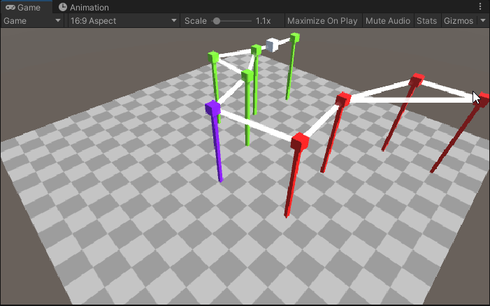
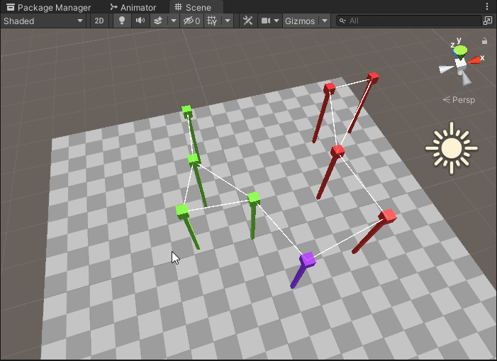

# Graph Node Framework

This is a framework-like-project I was making for one of my side projects. This "framework" is a collection of scripts for creating visual node-graphs in unity.

It implements node behaviour for selective connection to other nodes, pathfinding, baked pathfinding, sending packets, packet behaviour, event-listeners for different packet states etc.

Its pretty bare bones atm but I plan to expand it later on with proper editor windows, different pathfinding methods, a better dynamic pathing etc.

I also wanted to implement a demo game, but I couldn't get around to it, whats there is included under the sample project folder.